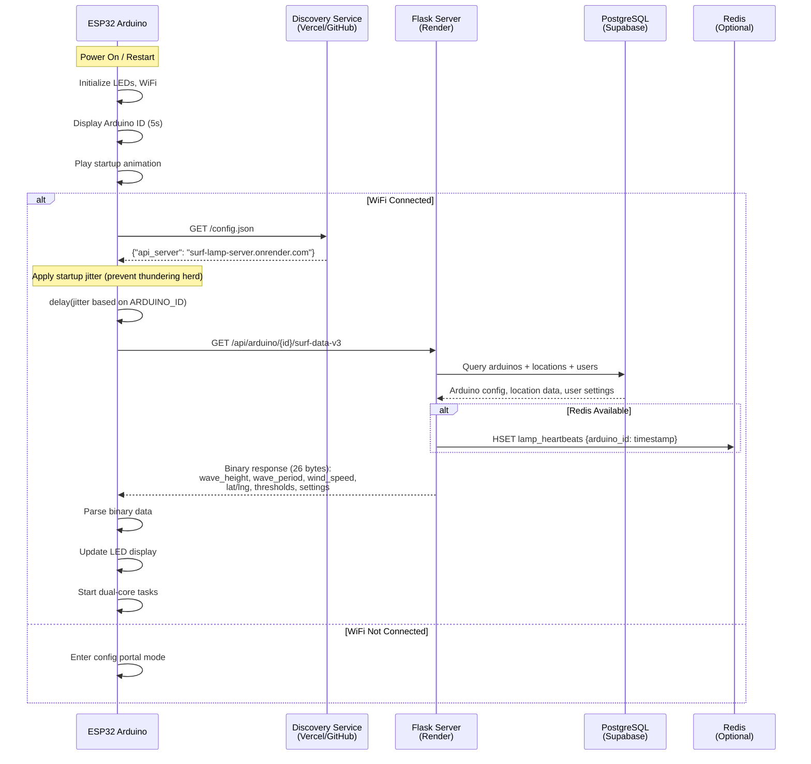
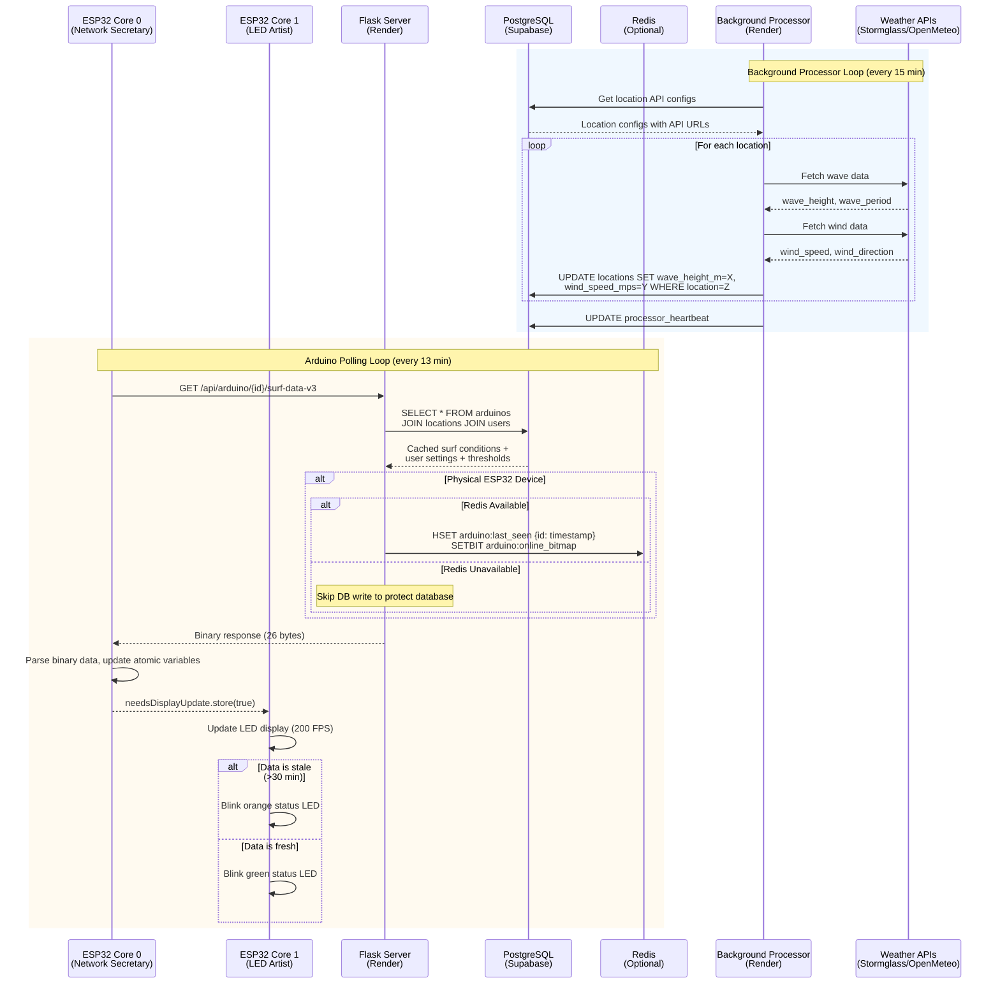

# Surf Lamp System Communication Diagrams

## 1. Lamp Startup Sequence

---

## 2. Normal Operation (Polling Loop)

---

## Key Components Summary

| Component | Role | Technology |
|-----------|------|------------|
| **ESP32 Arduino** | Display device, polls server every 13 min | C++, FreeRTOS dual-core |
| **Discovery Service** | Returns current API server URL | Vercel/GitHub static JSON |
| **Flask Server** | API gateway, serves data to Arduinos | Python Flask, Gunicorn |
| **Background Processor** | Fetches weather data, updates DB | Python, SQLAlchemy |
| **PostgreSQL** | Persistent storage | Supabase |
| **Redis** | High-performance heartbeat storage | Optional, reduces DB writes |

---

## Data Flow Notes

1. **Separation of concerns**: Processor fetches from weather APIs → DB. Arduinos fetch from Server → DB.
2. **Location-driven**: Data is stored per-location, multiple lamps can share the same location's data.
3. **Binary protocol (v3)**: 94% smaller than JSON (26 bytes vs ~450 bytes).
4. **Thundering herd prevention**: Startup jitter based on `ARDUINO_ID` prevents all lamps hitting server simultaneously after power outage.
