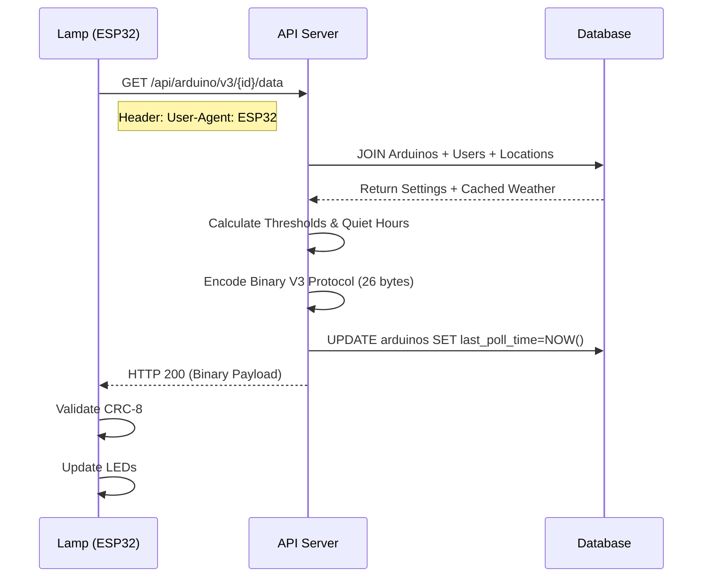
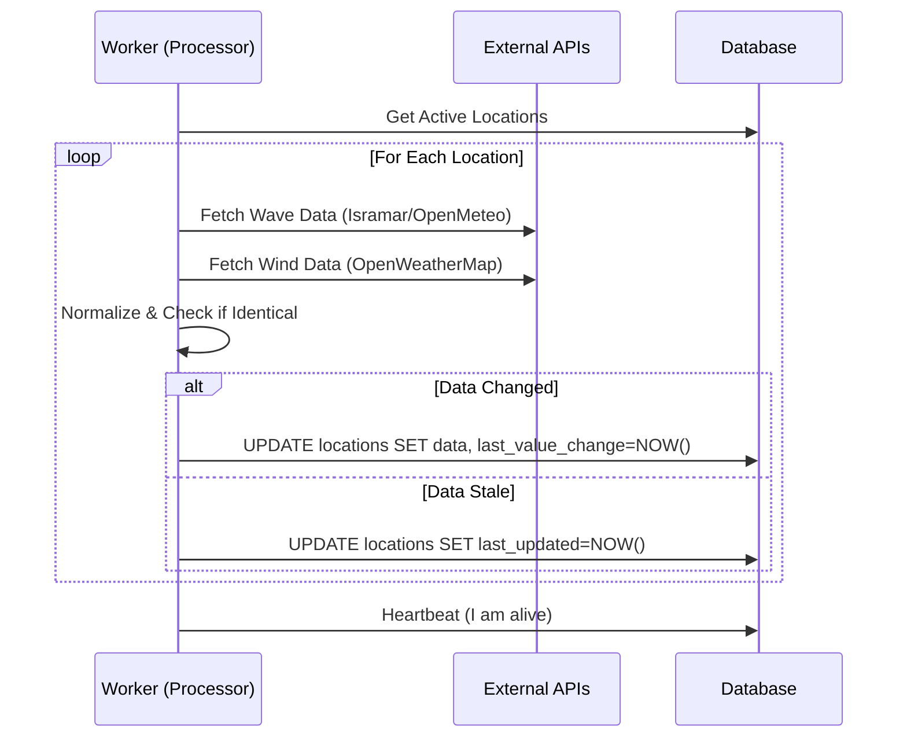
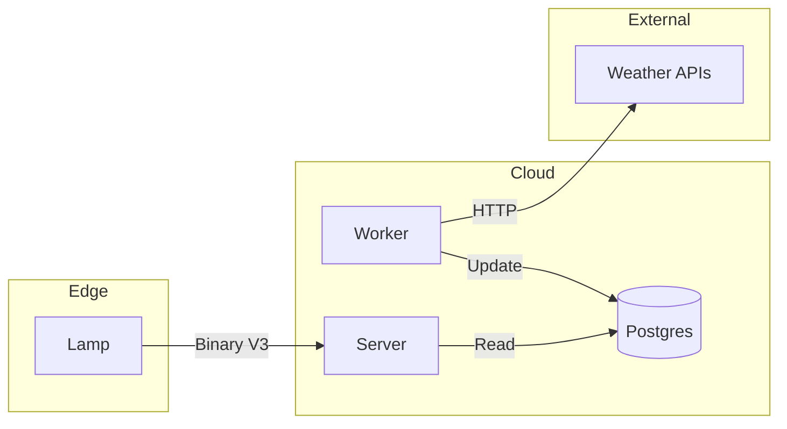

# Surf Lamp System - Architecture Review

## 1. System Overview "How it Works"
The Surf Lamp is a location-centric IoT system.
1. **Background Processor** (every 15 min) fetches weather for all active beaches and updates the database.
2. **API Server** serves this pre-fetched data to lamps on demand.
3. **Lamps** (every 13 min) wake up, pull data for their assigned location, and update their LED display.

This architecture decouples the hardware from external weather APIs, ensuring reliability and rate-limit protection.

---

## 2. Sequence Diagrams

### A. Lamp Runtime Flow (Device -> Server)
*Occurs every 13 minutes.*



### B. Weather Batch Flow (Worker -> External APIs)
*Occurs every 15 minutes.*



---

## 3. Implementation Details

### A. Entry Points

**1. Lamp Side (ESP32)**
*   **File:** `arduino_code/lamp_refractored/lamp_template/WebServerHandler.cpp`
*   **Request:** `GET https://<server>/api/arduino/v3/<ARDUINO_ID>/data`
*   **Payload:** None (GET request).
*   **Discovery:** Fetches `config.json` from GitHub to find server URL.

**2. Server Side (Flask)**
*   **File:** `web_and_database/blueprints/api_arduino.py` (Line 296)
*   **Route:** `@bp.route("/api/arduino/v3/<int:arduino_id>/data")`
*   **DB Model:** Joins `Arduino` (device), `User` (preferences), and `Location` (weather).
*   **Response:** 26-byte custom binary format (CRC-8 protected).

**3. Weather Service (Worker)**
*   **File:** `surf-lamp-processor/background_processor.py`
*   **Mechanism:** Python `schedule` loop running every 15 minutes.
*   **Providers:** Open-Meteo (Waves), OpenWeatherMap (Wind), Isramar (IL Waves).

---

## 4. Key Data Flows

### Flow 1: Lamp Data Request
**Lamp → Server:**
*   **Method:** GET
*   **ID:** Extracted from URL path.
*   **Context:** Server identifies "Physical Device" via `User-Agent` to update `last_poll_time`.

**Server → DB:**
```sql
SELECT * FROM arduinos 
JOIN users ON arduinos.user_id = users.user_id 
JOIN locations ON arduinos.location = locations.location 
WHERE arduino_id = ?
```

**Server → Lamp (Binary V3 Protocol):**
*   **Bytes 0-8:** Surf Data (Height, Period, Wind, Direction) + CRC.
*   **Bytes 9-25:** Settings (Theme, Brightness, Interval, Lat/Lon) + CRC.
*   **Total:** 26 Bytes.

### Flow 2: Weather Update
**Worker → External API:**
*   **Calls:** `fetch_surf_data` in `weather_api_client.py`.
*   **Retry:** Exponential backoff for 429/5xx errors.

**Worker → DB:**
*   **Logic:** Updates `locations` table. Checks `is_data_identical` to prevent "fake updates" from resetting the staleness timer.

---

## 5. Reliability & Caching

*   **Caching:** Server returns **last-known-good** data from DB.
*   **Staleness:** If data is identical for >60 mins, `stale_data_warning` bit is set in V3 packet. Lamp blinks orange.
*   **Offline:** If Lamp cannot reach server, it shows a specific "Server Unreachable" error code (Half Green/Blue).
*   **Optimization:** Sunset times cached in RAM for 24h. Coordinates cached for 1h.

---

## 6. Architecture Diagram



## 7. TODOs / Findings
1.  **Dependency:** `ServerDiscovery.h` relies on GitHub raw content for initial server URL.
2.  **Security:** `is_physical_device` check is weak (User-Agent based).
3.  **Testing:** `background_processor.py` contains a "Hang Bomb" for watchdog testing. Ensure strictly disabled in prod.
